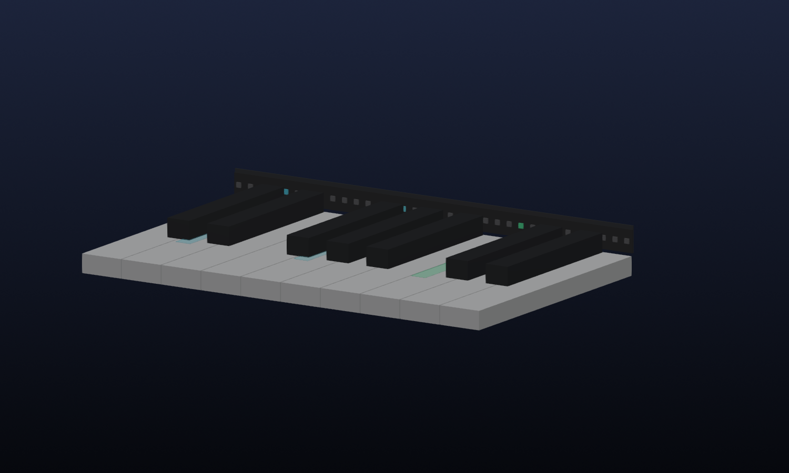
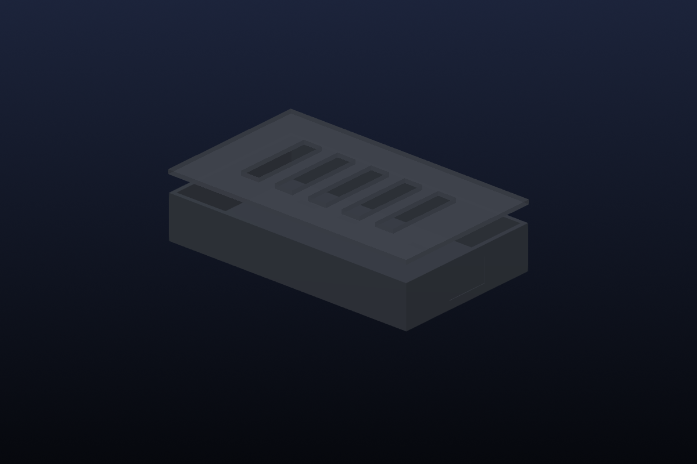

# NoteFall 88

NoteFall 88 是面向 Casio PX-S7000 的可拆卸单排琴键提示灯。钢琴通过 USB-MIDI 直接连接 ESP32-S3；ESP32-S3 驱动一条覆盖 88 键的 APA102C/SK9822 灯带，并通过 Wi-Fi 向手机、平板或电脑提供瀑布流练习网页。

> 钢琴上只有一排灯。瀑布流只在屏幕里显示。



> 琴键一侧不使用贯穿全长的 3D 打印盒。灯带竖直安装、发光面朝演奏者且前方无遮挡，宽角度光束的下半部分直接照亮对应琴键。可选黑色薄承载片只负责保持灯带笔直，不包裹灯珠，也不是打印件。

安装时若对“朝演奏者”或照键角度有疑问，以 [带标注的剖面光路图](docs/optical-installation.svg) 为准：灯带不是朝上，也不是架高悬空，而是紧邻键面竖直安装在钢琴自带的固定黑色立面上。

## 最终架构

```text
PX-S7000 USB TO HOST <──USB-MIDI──> ESP32-S3-DevKitC-1 N8R8
                                             │
                                SPI ──> 74AHCT125 ──> 单排灯带
                                             │
                                           Wi-Fi
                                             │
                              手机 / 平板 / 电脑浏览器
```

网页端可直接导入 MIDI、MusicXML、XML 和 MXL，按需显示瀑布流或五线谱，并提供实时、等我弹和跟随我三种练习模式、左右手筛选、25%–200% 五个百分点步进变速、±12 半音同步移调、A–B 循环和命中/错键/漏键统计。实时模式可启用按 MIDI/MusicXML 真实拍号、速度变化和反复顺序生成的 Web Audio 节拍器，以及一小节预备拍；常用练习设置刷新后保留。实时分析还会计算拍点早晚、平均/P95 时序误差、力度均值与波动、最长连续命中和逐键难点；每次练习连同原始乐谱 SHA-256、模式、声部、速度、移调与循环范围仅保存在本机，可导出 JSON。自适应教练按内容身份而非曲名汇总同谱近期历史，避免同名不同谱串曲，再找出错漏最集中的片段和较弱声部，给出有证据的模式、速度、A–B 建议并可一键应用；速度建议按表现以 5%/10%/15% 渐进调整。跟随我模式只要求用户弹一只手，另一只手经带时间戳的 USB-MIDI OUT 队列由 PX-S7000 自身音源演奏；若实机没有 OUT 端点则明确降级为无伴奏跟随。IndexedDB 曲库支持文件夹、并发内容去重，以及带 SHA-256、规模上限和原子恢复的完整备份；演奏录制包含力度、MIDI 通道和延音踏板，可导出标准 MIDI。钢琴按键数据走 USB 直达 ESP32，因此按键反馈不依赖无线链路。ESP32 默认建立 `NoteFall-88` 热点，浏览器打开 `http://192.168.4.1` 即可使用。

等待类模式要求目标和弦当前同时物理按住且没有仍按住的错误键，不能把各音逐个点过后松开来绕过和弦训练；目标音在整组和弦成立前只暂存、不计分，提前松键会撤销该音的暂存命中，因此也不能靠重复点按刷分。若正确和弦保持期间松开错误键，会立即一次性提交整组命中并推进，无需重弹。

录制导出会保留手指真实离键时刻、CC88 高分辨率力度前缀以及连续 CC64 半踏板、CC66/67 控制；实时练习分析在钢琴启用该选项时使用完整 14 位力度。若停止录制时延音踏板仍踩下，会自动补一个 CC64=0，避免文件回放时挂住踏板。

手机锁屏、切换 App 或页面进入后台时，网页会确定性暂停乐谱时钟和预备拍、急停钢琴伴奏、熄灭目标灯，并停止且保留当前录音，避免浏览器节流造成批量漏键、延迟伴奏或静默录音缺口；返回前台后停在同一练习位置，由用户手动继续。

为避免手机在误开录制后无限占用内存，单次录制最多 4 小时或 200,000 个 MIDI 事件；达到任一上限会自动停止、明确提示，并允许下载上限前已经完整保存的部分。

MusicXML 目标时间线会按常见反复、多结尾和标准 D.C./D.S./Fine/Coda 导航属性展开，并支持普通/附点 beat-unit 的精确 metric modulation；五线谱光标通过播放小节到书写小节的映射正确回跳，而不是只按页面顺序判分。

首次仍通过 UART 线刷；此后可在设备热点内用热点密码更新双槽固件或 LittleFS 网页。更新包由标签构建自动生成，包含两个镜像、版本/协议和 SHA-256 清单；维护入口不会从家庭 Wi-Fi 接口接受写入。详见 [安全更新说明](docs/update.md)。

手机离线使用由 ESP32 自己托管完整网页保证，不虚假依赖在局域网 HTTP 上通常不可注册的 Service Worker。浏览器曲库提供配额/持久化诊断和可校验备份；安全上下文、origin 隔离及 iOS/Android 验收边界见 [手机离线与本地数据](docs/mobile-offline-and-storage.md)。

内置安装向导把断电接线/保险丝/无损材料/三点灯位/机械稳定等人工确认，与 ESP 连接、PX-S7000 USB 枚举、MIDI IN 端点和真实中央 C Note On 自动证据合并；未齐全时始终显示“硬件尚未验收”，并可导出不含密码的 JSON 报告。详见 [引导式验收说明](docs/commissioning.md)。

## 硬件基线

- 乐鑫 ESP32-S3-DevKitC-1-N8R8
- 5 V、144 像素/米、IP30、黑色 PCB 的 APA102C 或 SK9822，一条连续灯带
- 最终使用前 176 像素，覆盖约 1222 mm 的 88 键键床
- 74AHCT125 成品电平转换模块
- 5 V / 5 A 有认证成品电源、3 A 总保险、20 AWG 首尾两端注电
- H5 给 USB-to-UART 口供电，H7 给 OTG Y 线的第 3 口供电；Y 线数据口经 USB-A 转 USB-B 打印机线连接钢琴
- Micro-Fit 4P 锁扣输入线和 XT30 远端注电线；所有引脚、线色和代焊验收已固定

第一次实际制作直接按 [五步装机清单](docs/first-build.md) 执行。完整采购见 [BOM 表](docs/bom.csv)，接线见 [硬件说明](docs/hardware.md) 与 [USB Host/供电决策记录](docs/decisions/001-native-usb-host-and-vbus.md)，可直接发给代焊方的规格见 [线束制造表](docs/harness.csv)、[线束图](docs/wiring-harness.svg) 和 [代工消息模板](docs/vendor-order-template.md)。逐项完成证据与实物边界见 [工程完成度审计](docs/completion-audit.md)。参数化控制盒如下；它只保护 ESP32 和接线，不安装在琴键上。



## 仓库内容

- `firmware/`：ESP32-S3 固件、USB-MIDI Host、Wi-Fi/WebSocket 和 APA102/SK9822 驱动
- `web/`：手机/平板/电脑通用网页，包含乐谱、曲库、练习、录制、诊断和校准
- `mechanical/`：可选控制器保护盒的 CadQuery 参数化模型；琴键侧没有打印导轨
- `config/system.json`：88 键、灯带、电气和机械参数的唯一来源
- `scripts/generate.py`：生成灯位映射、固件头文件和制造文件
- `tests/`：映射、功耗和机械包络测试
- `docs/`：接线、装配、校准、测试和开源项目技术调研

MusicXML 的当前支持范围、目标时间线与 OSMD 谱面之间的边界见 [MusicXML 说明](docs/musicxml.md)；练习指标定义和本地数据边界见 [练习分析说明](docs/practice-analytics.md)；手机与 ESP32 的稳定消息边界见 [WebSocket 协议](docs/protocol.md)。入站消息在进入练习状态前执行长度、类型、整数范围及 88 键校准完整性验证；实体按键灯先于网页广播刷新，并在诊断中显示 USB 回调到 SPI 完成的内部延迟。

## 从这里开始

1. 照片审查已确认琴键后方约 18–22 mm 固定立面可容纳 12 mm 灯带；下单后按 [一次性现场复核](docs/measurements.md) 用纸条做无接触安装验收，不需要打印试件或购买额外灯带。
2. 按 [BOM](docs/bom.csv) 买最终件，再按 [装配说明](docs/assembly.md) 让卖家代焊线束并组装。
3. 按 [刷机说明](docs/flashing.md) 首次写入固件和网页，并立即修改默认热点密码。
4. 严格依次执行 [断电检查、校准和验收](docs/testing.md)。

## 本地验证

```powershell
python -m pip install -r requirements-dev.txt
python scripts/generate.py --check
python -m pytest

cd web
npm.cmd ci
npm.cmd test -- --run
npm.cmd run build
npx.cmd playwright-cli install-browser chromium
npm.cmd run smoke:browser

cd ..
.\.venv\Scripts\platformio.exe run -d firmware
.\.venv\Scripts\platformio.exe run -d firmware -t buildfs
python scripts/render_cad.py
```

可选的真实 MusicXML 内容级交叉验证使用独立 `music21` 解析器；先按 [MusicXML 说明](docs/musicxml.md) 检出固定版本 OSMD 语料，再运行 `requirements-audit.txt` 与 `scripts/crosscheck_musicxml.py`。该环境不进入正式产品依赖。

网页构建结果直接写入 `firmware/data/`。JS/CSS 以预压缩 `.gz` 存储，ESP32 按原 URL 和正确 MIME/Content-Encoding 提供，既节省 Flash 也避开旧版 `mklittlefs` 的长文件名限制。随后可用 `platformio run -d firmware -t uploadfs` 写入开发板文件系统。

## 当前事实边界

软件、映射、CAD 和固件可以数字验证；Casio 官方文档确认 PX-S7000 的 USB-B 可双向发送/接收 MIDI 并驱动琴内音源，且把键盘发送的 Performance Controller 与外部接收的 C 组 Sound Generator 分开。固件不会依据时间相似性删除真实输入，只把疑似输出镜像计入诊断；具体实机的端点地址与镜像计数仍需验收。实际灯位偏移、温升和琴漆材料相容性也必须在实物上完成最终确认。网页校准允许反向灯带、修正全局像素偏移，并为个别琴键做 ±4 像素微调，不需要重新写固件。

项目采用 MIT 许可证。现有项目的硬件拓扑、通信方式、功能、优缺点和采用边界见 [开源项目技术调研](docs/open-source-review.md)；为什么把 AGPL-3.0 的 Piano Trainer Studio 提升为第一软件参考但不直接 fork，见 [PTS 采用决策](docs/pts-adoption-decision.md)。组合能力的逐项领先性证据见 [竞争能力审计](docs/competitive-benchmark.md)，候选版与硬件验证版的严格边界见 [发布门禁](docs/release-readiness.md)。
