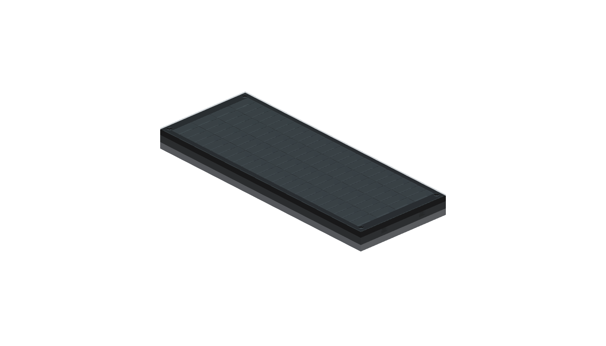

# NoteFall 88 — PX-S7000 可拆卸下落音符灯阵

NoteFall 88 是一套面向 Casio PX-S7000 的无损、可拆卸实体灯光辅助系统。电脑读取 MIDI 乐谱并计算未来音符位置，ESP32-S3 驱动固定在琴键后方的多排 APA102C / SK9822 灯阵。每一排代表一个离当前演奏时刻更近的时间切片；横向灯位对应真实琴键。



当前仓库处于 **V0 光学/机械验证阶段**。首件不是缩小版成品，而是一块完整一八度、4 时间排、96 像素的可打印实验夹具，用来尽早验证四个高风险问题：

1. 144 灯/米能否清楚区分相邻半音；
2. 黑色光栅和柔光片能否兼顾串光与可视角；
3. 低矮模块放在键后顶板上是否妨碍演奏；
4. 低亮度供电预算是否足够且无可见闪烁。

## 已形成的工程结论

- 灯阵放在**琴键后方顶板**，不悬在手指活动区上方。照片显示该方向最有希望兼顾视线与正常弹奏，但可用深度仍需实测。
- V0 每排使用 24 个 144 LED/m 像素，覆盖一个 164.5 mm 标准八度；4 排共 96 像素。灯带蛇形串联，只需一组时钟与数据。
- 采用黑色 PETG/PLA 可换蛋格光栅，顶部可装 0.6 mm 自然色 PETG 或磨砂 PP 柔光片；不把散射材料直接贴到灯带上。
- 装置与琴漆之间只接触可替换硅胶垫。胶粘面只粘装置，不粘钢琴；V0 以隐藏压舱垫圈增稳。
- ESP32 的 3.3 V 信号先经 74AHCT125 转为 5 V。琴和灯阵各用自己的电源，只通过 USB/MIDI 通信；禁止从琴的 USB 口给灯阵供电。
- 满亮 96 像素最坏情况约 29 W。V0 固件把全局亮度硬限制为 4/31，目标峰值约 4 W；验证供电仍按 5 V / 5 A 配置。完整 88 键不会按理论满白配置供电，而采用亮度硬限幅、分区注电和熔断。

## 仓库入口

- [`docs/00_requirements.md`](docs/00_requirements.md)：需求、边界和验收口径
- [`docs/01_architecture.md`](docs/01_architecture.md)：总体架构和模块接口
- [`docs/02_measurements.md`](docs/02_measurements.md)：只需用户完成的现场测量
- [`docs/03_v0_build.md`](docs/03_v0_build.md)：首件打印、接线和装配
- [`docs/04_test_plan.md`](docs/04_test_plan.md)：逐项测试与通过/失败判据
- [`docs/05_safety.md`](docs/05_safety.md)：供电、温升、琴漆和失效安全
- [`docs/06_roadmap.md`](docs/06_roadmap.md)：从 V0 到 88 键的阶段路线
- [`docs/07_references.md`](docs/07_references.md)：公开规格、数据表与事实边界
- [`docs/08_photo_review.md`](docs/08_photo_review.md)：三张现场照片的工程审查
- [`docs/bom_v0.csv`](docs/bom_v0.csv)：V0 与全尺寸预估 BOM
- [`mechanical/`](mechanical/)：CadQuery 参数化机械模型和制造导出
- [`firmware/`](firmware/)：ESP32-S3 / PlatformIO 固件
- [`host/`](host/)：MIDI 文件、演示灯效和串口协议工具

## 快速验证（无需硬件）

```powershell
.\.venv\Scripts\python.exe -m pytest
.\.venv\Scripts\python.exe mechanical\generate.py
.\.venv\Scripts\python.exe mechanical\render.py
.\.venv\Scripts\python.exe -m host.notefall demo --dry-run --seconds 2
.\.venv\Scripts\python.exe tools\engineering_budget.py
```

制造文件输出到 `mechanical/exports/`。默认参数是待测量前的安全起点，不应直接扩展成 88 键成品。

## 外部事实边界

Casio 公布 PX-S7000 本体为 1340 × 242 × 102 mm、88 键；这些数据只用于总体包络。琴键八度尺寸、顶板有效深度、键面高度差和控制区避让均以本机实测为准。
