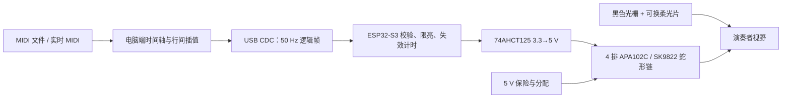

# 系统架构

## 物理布局

灯阵位于琴键后方的非运动顶板上，模块前缘与键后基准线平行。由近到远的 4 排依次表示 0、350、700、1050 ms；这些时间可在电脑端按曲速缩放。V0 每排 24 像素，覆盖 C–B 的 12 个半音。一个音符映射到离其几何中心最近的像素，最大理论横向误差不超过半个灯距（3.47 mm）。

## 为什么不是“一键一灯”灯条

标准八度约 164–165 mm，而 144 LED/m 灯距为 6.944 mm，因此每个白键约有 3.38 个像素。88 个半音的物理中心并非等距：黑键和白键交替。固件/电脑使用真实键中心标定表，将音符选择到最近的物理像素；多余像素用于抗混叠和光点宽度，不强行按 MIDI 半音等距排列。

## 机械模块

- **底座**：承担硅胶防滑垫和可封闭压舱垫圈；不夹紧琴体。
- **灯带托盘**：约束 4 条灯带位置并保护焊点；灯带胶只粘托盘。
- **蛋格光栅**：每个 LED 一个光学单元，黑色打印，控制相邻灯串光。
- **柔光片**：独立薄片，可测试“无柔光 / 0.6 mm PETG / 磨砂 PP”三种条件。
- **对齐规**：只在安装时使用，两条指针跨一个 C–C 八度对准键缝，随后移除。

V0 采用 4 颗 M3 螺钉贯穿堆叠。全尺寸版本预计改为 7 个可插拔八度瓦片加两端短瓦片，并由低矮主梁保证直线度；控制区位置测量后再决定中部桥接或分段避让。

## 电气拓扑

V0 的 4 × 24 像素蛇形串联：近排左→右，第二排右→左，第三排左→右，远排右→左。相邻排在同一侧短接，减少长跳线。数据链首端串联 68–150 Ω 阻尼电阻；ESP32-S3 的 DATA/CLOCK 必须通过 74AHCT125（VCC=5 V）或等效 3.3 V 兼容高速缓冲器。

灯阵电源与 ESP32 USB 地共地，但 5 V 大电流不经过开发板。V0 使用 5 A 保险丝/自恢复保险与星形接地。全尺寸候选为每 1–2 个模块独立注电的 5 V 母线，不能让数十安培沿灯带铜箔级联。

## 数据协议

主机发送固定头、版本、消息类型、长度、序号、载荷、CRC16-CCITT。逻辑帧只传 `row × note × RGB`，不传裸灯带像素。这样，机械标定和蛇形布线只存在于设备布局表中，电脑音乐逻辑与具体灯号解耦。

- 帧率：50 Hz；V0 载荷 148 B，串口开销很小。
- 固件全局亮度上限：4/31，主机不能越权提高。
- 连续 1000 ms 未收到合法帧：立即熄灯。
- CRC 错误、尺寸错误、版本错误：丢弃整帧，不部分更新。

## 全尺寸容量预估

按 1.225 m 键盘宽度估计，每排约 177 像素，4 排约 708 像素。4 MHz 下单次 APA102 数据刷新约 5.7 ms（含协议裕量），可满足 50 Hz。理论满白可超过 200 W，因此成品必须保留硬件/固件双重限流思路；正常教学画面只有少量音符点亮，设计连续功耗目标暂定 25 W、短时峰值 50 W，待 V0 实测光效后冻结。

