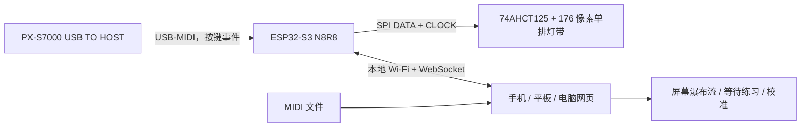

# 系统架构

## 设计结论

实体端采用一条单排灯带，不在琴上制作多排瀑布流。屏幕瀑布流负责表达未来时间；实体灯带只表达下一组目标键、当前按键及对错反馈。

## 时序分工

- USB-MIDI 事件由 ESP32 直接读取并立即更新灯带，按键反馈不绕行手机。
- 网页在本机浏览器解析 MIDI、维护播放时钟并绘制瀑布流。
- 网页只把“下一组目标键”发送给 ESP32。该信息本来就提前约 0.9 秒显示，因此局域 Wi-Fi 的毫秒级波动不会改变可弹奏性。
- 等待模式由网页维护目标和得分，ESP32 将实际按键事件实时回传。
- WebSocket 断开或目标超过 3 秒未更新时，ESP32 清除目标灯；USB 按键可继续短暂显示。

## 灯位映射

88 键并非等距半音。映射生成器先按 52 个等宽白键建立白键中心，再把黑键中心放在相邻白键边界处，最后选择最近的物理 LED。176 像素的间距为 6.944 mm，任一琴键中心到主像素的理论误差不超过 3.472 mm。

网页可设置灯带方向和全局像素偏移。这两个参数保存在 ESP32 NVS 中，因此灯带从左或从右进线都不需要重新编译。

## 网络模式

ESP32 始终建立密码保护的 `NoteFall-88` 热点，地址固定为 `192.168.4.1`。如果网页写入家庭 Wi-Fi 凭据，设备同时以 STA 模式接入路由器并注册 `notefall.local`；热点继续保留作为恢复入口。

## 安全边界

- 灯带功率不经过开发板。
- 3.3 V DATA/CLOCK 经 5 V 供电的 74AHCT125 缓冲。
- 灯带固件全局亮度硬上限为 4/31，网页不能越权。
- 上电、USB 断开、WebSocket 目标超时和解析错误都以熄灭目标灯为安全状态。
- 钢琴 USB 只承载 MIDI，不给灯带供电。
