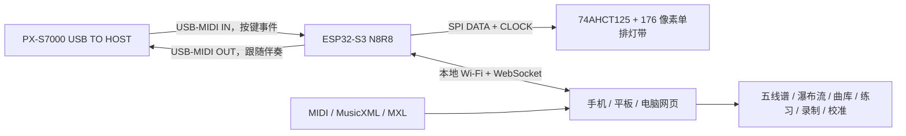

# 系统架构

## 设计结论

实体端采用一条单排灯带，不在琴上制作多排瀑布流。屏幕瀑布流负责表达未来时间；实体灯带只表达下一组目标键、当前按键及对错反馈。

## 时序分工

- USB-MIDI 事件由 ESP32 直接读取并立即更新灯带，按键反馈不绕行手机。
- 网页在本机浏览器解析 MIDI、维护播放时钟并绘制瀑布流。
- 网页只把“下一组目标键”发送给 ESP32。该信息本来就提前 0.3～2.0 秒显示，因此局域 Wi-Fi 的毫秒级波动不会改变可弹奏性。
- 等待模式由网页维护目标和得分，ESP32 将实际按键事件实时回传。
- 跟随模式在用户完成当前练习手和弦后，由网页生成另一只手的相对时间事件；ESP32 在本地排程并经钢琴 USB MIDI OUT 播放，不依赖浏览器定时器逐音发送。断线、复位和熄灯会清空排程并发送 Sustain Off / All Notes Off。
- 网页每 1 秒刷新一次未变化的目标，允许用户在等待模式中长时间思考；WebSocket 断开或目标超过 3 秒未更新时，ESP32 仍会清除目标灯。
- USB Host 回调只负责接收和入队；连接通知、MIDI 处理、WebSocket 和灯带状态更新全部回到 Arduino 主任务，避免跨任务操作网络对象。

## 两路音符数据与职责边界

这两个来源不能混为“一路 MIDI”：

| 数据流 | 来源 | 主要消费者 | 含义 |
|---|---|---|---|
| 参考/目标音符 | 浏览器加载的 MIDI 或 MusicXML/MXL | 浏览器练习引擎、ESP32 目标灯层 | 现在或将来应该弹哪些键 |
| 实际演奏音符 | PX-S7000 USB-MIDI → ESP32 | ESP32 即时按键灯、浏览器判分/录制 | 用户实际上弹了哪些键、力度和踏板状态 |

浏览器比较目标与实际演奏并计算命中、漏键和等待推进。ESP32 不解析完整乐谱，但保留目标集合的短期副本用于实体提示；同时它直接处理实际演奏事件，因此即使 Wi-Fi 短暂抖动，按键即时反馈仍可工作。

这与 Piano Trainer Studio 的“浏览器计算目标和判分、WLED 通常只收 RGB 帧”思路有相同的职责原则，但物理边界不同：NoteFall 由 ESP32 直接做 PX-S7000 USB Host 和 APA102/SK9822 驱动，不要求手机浏览器支持 Web MIDI，也不需要 WLED/helper。

## 软件实现与许可证边界

Piano Trainer Studio 是第一软件/产品参考，但采用 AGPL-3.0 且默认硬件拓扑不同。本仓库保持 MIT 独立实现，不 fork 或复制其主代码。MusicXML/MXL 已通过独立时间线解析器与 BSD-3-Clause 的 OSMD 接入；完整比较见 [PTS 采用决策](pts-adoption-decision.md)。

### Core / Studio 演进边界

当前固件内置的是可离线使用的 **NoteFall Core**：USB Host、实时灯光、安全/诊断，以及足以在手机上完成日常练习的网页。PTS 的重型谱面与转换资源本来也运行在浏览器而不是 WLED；因此资源是否能塞进 LittleFS 不是采用或拒绝 PTS 前端的决定性理由。

未来若需要 MuseScore/Guitar Pro 原地转换、大型曲库分析或更复杂音频，可增加独立的 **NoteFall Studio**（预安装 PWA、原生移动壳或桌面应用），仍通过同一语义协议连接 Core。这样重型资源由手机/平板/电脑存储，ESP 继续保留轻量救援网页。外部 HTTPS PWA 访问局域网明文 WebSocket/私网设备时存在浏览器安全策略差异，因此发布前必须分别验证 iOS、Android；若策略不可控，原生壳是确定性更高的交付方式。

## 练习引擎

- `等我弹`：当前和弦的所有目标音都命中后才前进；重复按同一个正确音不重复计分，错误音单独统计。
- `实时`：音符使用提前 180 ms、延后 250 ms 的命中窗口；窗口过后未命中的目标记为漏键。
- `跟随我`：限定练习一只手；用户完成目标和弦后，另一只手由 PX-S7000 自身音源播放，再按原谱间隔与所选速度进入下一组。伴奏同音重触发前会先结束旧音，循环跨界按 A–B 时间轴计算。
- 左手、右手或双手筛选发生在和弦分组之前，因此目标灯和判分使用同一组音符。
- A–B 循环限制目标、判分和播放时钟；到达 B 点后回到 A 点并开始新一轮匹配，累计成绩不清零。
- 移调限制为 ±12 半音：统一时间线、瀑布流、实体目标和 OSMD 五线谱同步改变；超出 A0–C8 的音符从可弹目标中剔除，原始曲库文件不被修改。
- MusicXML 先把反复、多结尾、D.C./D.S./Fine/Coda 展开为播放小节序列，再统一换算速度和秒时间；每个播放小节保留书写小节索引供 OSMD 光标回跳，目标、判分、循环和跟随伴奏消费同一展开结果。
- 屏幕仍可低亮度显示未选择声部，实体灯只提示正在练习的声部。
- 逐音分析记录正确、错键和漏键事件；实时模式额外记录相对目标起点的有符号时序误差。浏览器据此计算拍点偏置、平均/P95 绝对误差、力度波动、连续命中和逐键错误率，而不是只保留一个总分。
- 一次练习结束、复位或改变模式/声部/循环/移调时，非空会话写入独立 IndexedDB。最多保留最近 500 次，完整事件最多 20,000 个；不上传云端，可由用户导出版本化 JSON。
- 自适应教练最多读取同一乐谱最近 20 次记录，用加权错漏密度选择 4–12 秒难点窗口，用左右手独立错误率选择声部，并按准确率/时序误差在 50/75/100/125/150% 档位间调整速度。建议始终显示证据量和置信度，用户一键应用后才改变练习设置。
- MIDI 以 PPQ 和拍号事件生成拍点；MusicXML 以展开后的播放小节、`beats`/`beat-type` 与速度事件生成拍点。节拍器在动画帧中只选择未来 120 ms 的拍点，实际发声交给 Web Audio 时间轴，不依赖 `setInterval` 精度；A–B 回绕会取消旧排程并从 A 重新定位。
- 预备拍从起点所在拍号推断一小节长度和局部拍间隔；预备期间乐谱时钟与判分保持暂停。暂停、复位、切换模式或到达结尾都会取消尚未发声的振荡器，避免残留点击。

指标的严格定义和隐私边界见 [练习分析说明](practice-analytics.md)。

## 协议与诊断

当前 WebSocket 协议版本为 `5`。ESP32 每秒上报固件版本、USB 连接状态、VID/PID、IN/OUT 端点与包长、双向累计包数、排程深度、队列丢包、传输错误、回声抑制次数、连接次数、空闲堆、PSRAM 总量/余量和 Wi-Fi RSSI。音符事件包含 1–16 通道；控制事件包含 CC 编号和值，当前使用 CC64 延音以及 CC120/123 全部音符关闭。浏览器的 MIDI OUT 消息只接受 60 秒内、状态/数据字节合法的事件，固件固定容量排程并再次限幅；疑似钢琴环回的完全相同消息在 80 ms 窗口内被消费，避免伴奏被误判为用户演奏。校准消息同步 88 个逐键像素修正，修正范围为 ±4 且由固件再次限幅。诊断只读，不包含 Wi-Fi 密码。

完整字段、示例、限幅和版本演进规则见 [WebSocket 协议 v5](protocol.md)。

## 灯位映射

88 键并非等距半音。映射生成器先按 52 个等宽白键建立白键中心，再把黑键中心放在相邻白键边界处，最后选择最近的物理 LED。176 像素的间距为 6.944 mm，任一琴键中心到主像素的理论误差不超过 3.472 mm。

网页可设置灯带方向、全局像素偏移和 88 键独立微调。参数保存在 ESP32 NVS 中，因此灯带从左或从右进线、或个别灯位存在装配公差，都不需要重新编译。逐键修正只在三点/全局校准后使用，限制为 ±4 个像素，避免误操作跳到远处琴键。

## 网络模式

ESP32 始终建立密码保护的 `NoteFall-88` 热点，地址固定为 `192.168.4.1`。如果网页写入家庭 Wi-Fi 凭据，设备同时以 STA 模式接入路由器并注册 `notefall.local`；热点继续保留作为恢复入口。

## 安全边界

- 灯带功率不经过开发板。
- 3.3 V DATA/CLOCK 经 5 V 供电的 74AHCT125 缓冲。
- 灯带固件全局亮度硬上限为 4/31，网页不能越权。
- 上电、USB 断开、WebSocket 目标超时和解析错误都以熄灭目标灯为安全状态。
- 钢琴 USB 只承载 MIDI，不给灯带供电。
- HTTP 更新写接口只接受设备 SoftAP 本地接口上的请求，并用不回显的热点密码请求头再次认证；家庭 Wi-Fi/STA 客户端即使能打开练习页也不能刷写。
- 固件分区是两个等大的 2.5 MiB OTA 槽，运行槽不会被原地覆盖；LittleFS 独立为 2.875 MiB。更新开始前清空灯光、伴奏排程并发送全通道急停。
- 浏览器在上传前检查扩展名、最小合理体积和设备动态报告的分区上限；固件端仍由 Arduino Update 校验固件魔数、写入长度和激活结果。只有设备返回成功 JSON 后页面才提示重启。

## 引导式实机证据

安装向导的状态机把八个人工物理确认和四个自动证据分开。自动证据只由兼容协议状态帧、USB Host 端点和真实 MIDI Note On 写入；测试灯按钮不能伪造“弹过中央 C”。固件变化会撤销完成状态并清除需要重测的 USB/按键证据。报告使用独立版本 1 JSON，不含网络密码。完整字段见 [引导式安装与实机验收](commissioning.md)。
