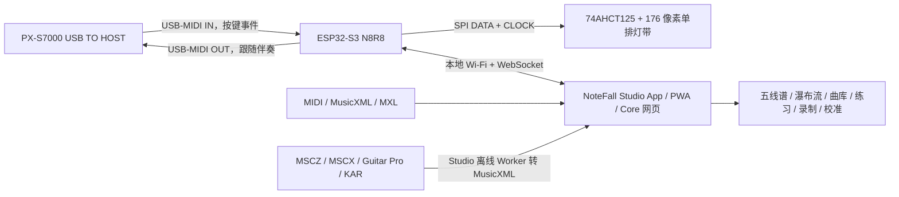

# 系统架构

## 设计结论

实体端采用一条单排灯带，不在琴上制作多排瀑布流。屏幕瀑布流负责表达未来时间；实体灯带只表达下一组目标键、当前按键及对错反馈。

## 时序分工

- USB-MIDI 事件由 ESP32 直接读取并立即更新灯带，按键反馈不绕行手机。
- 网页在本机浏览器解析 MIDI、维护播放时钟并绘制瀑布流。
- 网页只把“下一组目标键”发送给 ESP32。该信息本来就提前 0.3～2.0 秒显示，因此局域 Wi-Fi 的毫秒级波动不会改变可弹奏性。
- 等待模式由网页维护目标和得分，ESP32 将实际按键事件实时回传。
- 跟随模式在用户完成当前练习手和弦后，由网页生成另一只手的相对时间事件；ESP32 在本地排程并经钢琴 USB MIDI OUT 播放，不依赖浏览器定时器逐音发送。断线、复位和熄灯会清空排程并发送 Sustain Off / All Notes Off。
- 网页每 1 秒刷新一次未变化的目标，允许用户在等待模式中长时间思考；WebSocket 断开或目标超过 3 秒未更新时，ESP32 仍会清除目标灯。
- USB Host 回调只负责接收、打微秒时间戳和写固定队列；Arduino 主任务排空同批事件后先完成一帧灯带 SPI，再从另一条固定队列广播网页 MIDI。慢客户端或 Wi-Fi 抖动不能排在实体按键灯之前，也不会跨任务操作网络对象。

## 两路音符数据与职责边界

这两个来源不能混为“一路 MIDI”：

| 数据流 | 来源 | 主要消费者 | 含义 |
|---|---|---|---|
| 参考/目标音符 | 浏览器加载的 MIDI 或 MusicXML/MXL | 浏览器练习引擎、ESP32 目标灯层 | 现在或将来应该弹哪些键 |
| 实际演奏音符 | PX-S7000 USB-MIDI → ESP32 | ESP32 即时按键灯、浏览器判分/录制 | 用户实际上弹了哪些键、力度和踏板状态 |

浏览器比较目标与实际演奏并计算命中、漏键和等待推进。ESP32 不解析完整乐谱，但保留目标集合的短期副本用于实体提示；同时它直接处理实际演奏事件，因此即使 Wi-Fi 短暂抖动，按键即时反馈仍可工作。

这与 Piano Trainer Studio 的“浏览器计算目标和判分、WLED 通常只收 RGB 帧”思路有相同的职责原则，但物理边界不同：NoteFall 由 ESP32 直接做 PX-S7000 USB Host 和 APA102/SK9822 驱动，不要求手机浏览器支持 Web MIDI，也不需要 WLED/helper。

## 软件实现与许可证边界

Piano Trainer Studio 是第一软件/产品参考，但采用 AGPL-3.0 且默认硬件拓扑不同。本仓库不 fork 或复制其主代码；NoteFall 原创源码与 Core 保持 MIT。MusicXML/MXL 已通过独立时间线解析器与 BSD-3-Clause 的 OSMD 接入。Studio 另外从上游 npm 发行包独立引入 GPL `webmscore-webpack5` 用于离线格式转换；含该库的 Studio 组合发行物按 GPL-3.0 传递，不改变不含该库的 Core 许可证。完整比较见 [PTS 采用决策](pts-adoption-decision.md)和 [ADR-005](decisions/005-studio-score-converter.md)。

### Core / Studio 分层

固件内置可离线使用的 **NoteFall Core**：USB Host、实时灯光、安全/诊断，以及足以完成日常练习的救援网页。独立的 **NoteFall Studio** 已建立自己的构建、PWA 清单、Android/iOS 原生平台工程、可配置 Core 地址，以及五线谱/瀑布流分屏。两者共享经过测试的 MusicXML、练习、曲库和协议源码，不复制两套业务引擎。

Core 的“离线”是 ESP32 本地托管，不是 Service Worker 缓存。Studio PWA 的资源由自己的安全 origin 缓存，包括固定版本的 MuseScore/Guitar Pro WebAssembly 转换运行时；Android/iOS App 则把同样资源随安装包提供，并由原生平台工程声明局域网和明文私网访问策略。设备热点的 HTTP origin、安全上下文与持久存储边界见 [手机离线与本地数据](mobile-offline-and-storage.md)。

Studio 仍通过同一语义协议连接 Core，重型资源由手机/平板/电脑存储，ESP 继续保留轻量救援网页。正式平板路线采用混合原生容器：OSMD 谱面保留 WebView；Android 瀑布流由硬件加速原生 View 使用单调时钟逐帧绘制，Web/PWA 与暂未有 Xcode 构建环境的 iOS 使用 Canvas/WebGL 回退。真正重写的是呈现/交互层，不是 MusicXML、评分、曲库、协议或固件。选型、性能门禁与局部原生化边界见 [ADR-004](decisions/004-studio-hybrid-native.md)。

练习页面提供统一的“全屏演奏”状态：入口固定在可视化画面内，不占顶部工具条；用户也可记忆“播放时自动进入全屏”。Web/PWA 使用 Fullscreen API，并在权限或浏览器策略拒绝时降级为纯 CSS 沉浸布局；Android 通过原生桥隐藏状态栏和导航栏。两条路径共享相同的三视图布局、退出按钮和安全区处理，不把全屏能力绑死在某个浏览器实现上。

瀑布流另有独立的“演奏视野”参数（近距离 2.8 秒、标准 4.2 秒、远距离 6.5 秒）。该参数只控制屏幕纵向时间尺度，与实体灯提前量分离；Web Canvas 与 Android 原生 View 使用同一持久化值，避免两个发行物出现视觉时序差异。

MusicXML 踏板目标在反复展开后转换为独立提示轨；踩下、抬起、换踏和半踏分别显示 `PED ↓ / ↑ / ↻ / 百分比`。换踏在评分层保留抬起和再踩两个边沿，在视觉层合并为一个动作；Web Canvas 与 Android 原生 View 共享相同提示数据。

瀑布流右缘绘制 72 段全曲指纹：左、右半轨分别编码左右手音符密度，白色游标表示整曲位置，白色框表示当前屏幕预览窗口，启用 A–B 时再叠加金色练习区间。密度在载入乐谱时预计算，逐帧只绘制固定 72 段，不随曲长增加渲染复杂度；Web Canvas 与 Android 原生 View 采用相同算法和语义。

目标力度通过音符体亮度、内部高光宽度和落键端白色“力度帽”共同编码，但绝不改变音符横向位置或宽度。归一化保留 72% 的 MIDI 绝对力度与 28% 的曲内 10%–90% 分位对比；整首弱奏仍明显弱于整首强奏，同时单个异常速度值不会压扁其余层次。未选择声部继续固定低亮度，避免力度编码破坏声部筛选语义。

实时命中还在对应琴键上显示短暂的“早 / 准 / 晚”时序尺：±25 ms 视为准点，偏差位置按有符号毫秒数移动并在 ±250 ms 截断。宽键位显示精确毫秒数，手机窄键位只保留箭头/圆点和颜色，避免文字互相覆盖；Web Canvas 与 Android 原生 View 共享同一阈值、方向与颜色语义。

## 练习引擎

- `等我弹`：当前和弦的所有目标音都命中后才前进；重复按同一个正确音不重复计分，错误音单独统计。
- `实时`：默认采用逐和弦自适应判定窗，按当前位置真实拍间隔计算提前/延后容差，并提供宽容/自适应/严格三档；快速重复同音会把窗口限制在相邻同音间隔的 48% 内，防止一个 Note On 跨到前后两个目标。窗口存于乐谱时间轴，改变练习速度时自动换算现实毫秒值，从而保持相同音乐拍值比例；窗口过后未命中的目标记为漏键。
- `跟随我`：限定练习一只手；用户完成目标和弦后，另一只手由 PX-S7000 自身音源播放，再按原谱间隔与所选速度进入下一组。伴奏同音重触发前会先结束旧音，循环跨界按 A–B 时间轴计算。
- 左手、右手或双手筛选发生在和弦分组之前，因此目标灯和判分使用同一组音符。
- A–B 循环限制目标、判分和播放时钟；到达 B 点后回到 A 点并开始新一轮匹配，累计成绩不清零。
- 移调限制为 ±12 半音：统一时间线、瀑布流、实体目标和 OSMD 五线谱同步改变；超出 A0–C8 的音符从可弹目标中剔除，原始曲库文件不被修改。
- MusicXML 先把反复、多结尾、D.C./D.S./Fine/Coda 展开为播放小节序列，再统一换算速度和秒时间；每个音符保留展开后的拍位置，每个播放小节保留书写小节索引。OSMD 光标因而能在同一小节内逐音前进，并在反复或跳转时回到正确的印刷小节；目标、判分、循环和跟随伴奏消费同一展开结果。光标颜色表达当前手别，判定反馈直接浮现在谱面光标旁，不强迫演奏者把视线移向成绩栏。
- 同一展开后时间线还驱动全曲小节练习热力带：每个播放出现次数分别聚合命中、错音、漏音和平均绝对时序偏差，映射为稳定/注意/薄弱三档。它与印刷小节标签同时显示，因此反复段不会把第一遍与第二遍的表现错误合并；点击任一热力段会走正式“小节重开”流程，而不是只移动画面游标。
- 瀑布流在装载乐谱时把 35 ms 内的近同时音符预聚合为和弦星座；逐帧只绘制未来 1.8 秒内、至少包含两个当前练习声部音符的弧线与节点。跨双手和弦在弧顶增加菱形协调标记。Web Canvas 和 Android 原生 View 使用相同时间窗、显隐和主题语义，既帮助识别和弦形状，又避免给单音旋律增加噪声。
- 屏幕仍可低亮度显示未选择声部，实体灯只提示正在练习的声部。
- 逐音分析记录正确、错键和漏键事件；命中同时保存实弹/谱面目标力度，实时模式额外记录相对目标起点的有符号时序误差。浏览器据此计算拍点偏置、平均/P95 绝对误差、连续命中和逐键错误率；表现力层把会话级普遍偏轻/偏重作为独立力度基准，再以相关性和基准校正残差评价相对强弱轮廓。目标力度没有足够变化时不产生轮廓分，避免用一个虚假的百分比代替证据。
- 实时命中还由独立的多通道/同音队列继续跟踪 Note Off 与 CC64。物理按键时长和踏板释放后的发声时长分别回填到原命中事件，不增加虚假的判定次数；目标时值按练习速度缩放，并识别 MusicXML 常见断奏/保持记号。时值覆盖、无踏板释放精度、提前收音和踏板延长进入复盘、趋势、教练及弱点巡回；由于当前时间线没有足够可靠的踏板记号，踏板过长只陈述事实而不伪判艺术对错。
- 和弦同步层只按完全相同的谱面起点聚合命中，并拒绝含漏音的残缺组；它由同一硬件采集时间轴计算最早/最晚落键跨度及右手相对左手的平均偏移，因而能把“整组都晚但内部整齐”与“拍点正确但双手散开”分开。稳定样本进入 24 段复盘、同谱趋势与教练调速；弱点巡回可生成只能在实时模式验收的双手/单手和弦专项关卡。
- USB 回调用 ESP32 单调时钟给每个琴键和踏板事件打时间戳；周期 `ping/pong` 同时返回浏览器发送时刻和 ESP32 处理时刻，网页在近期样本中选择往返时间最低者，将设备时钟投影到 `performance.now()`。实时匹配与 MIDI 录音使用投影后的采集时刻而非 WebSocket 到达时刻；算法显式处理 uint32 回绕、设备重启、未来/过旧事件，并把半个最佳 RTT 作为同步误差上界显示。没有可用样本时安全退回到达时间，不伪造同步精度。
- 一次练习结束、复位或改变模式/声部/循环/移调时，非空会话写入独立 IndexedDB。最多保留最近 500 次，完整事件最多 20,000 个；不上传云端，可由用户导出版本化 JSON。
- 自适应教练用原始乐谱 SHA-256 而不是易冲突的曲名识别同一乐谱，最多读取最近 20 次记录；再用加权错漏密度选择 4–12 秒难点窗口，用左右手独立错误率选择声部，并按准确率、时序误差、力度轮廓、时值释放和和弦整齐度在 25%–200% 范围内以 5%/10%/15% 渐进调整速度。音高和拍点已稳定但任一有证据的表达/同步指标未达标时也不会盲目提速；建议始终显示证据量和置信度，用户一键应用后才改变练习设置。
- 弱点巡回把“一次建议”升级为可执行的掌握路线：最多读取同谱最近 24 次记录并按新近程度衰减，分别聚合反复展开后的每个播放小节，综合漏音、错音、绝对时序、力度轮廓、时值覆盖、和弦同步、谱面踏板、证据量和左右手错误率，选出最多三个不重叠片段；每关自动带入一个上下文小节，给出模式、声部、速度及适用的准确率/时序/力度/时值/和弦/踏板门槛，并要求有效判定至少覆盖该关所选声部的全部目标音。同步和踏板关卡固定使用实时模式，因为 Wait for Me 没有绝对时点。用户显式提交本轮后，只有连续两次达标才进阶，失败会清零连续计数；同谱内容身份、关卡进度与尝试次数写入本机 `localStorage`，刷新可恢复，不上传网络，畸形或跨谱缓存会被拒绝。
- 跨曲目“今日练习”以曲库 SHA-256 连接最多 500 次本机历史，只接受无 A–B 且判定事件覆盖至少 60% 目标音的全曲记录。最近三次按 55/30/15% 加权，组合准确率、拍点、力度、时值、和弦与谱面踏板形成可解释掌握度；薄弱曲优先，连续稳定后按 1/3/7/14/30/60 天复习。它不上传数据，也不会让短循环的高分延长整曲复习间隔。
- MIDI 以 PPQ 和拍号事件生成拍点；MusicXML 以展开后的播放小节、`beats`/`beat-type` 与速度事件生成拍点。节拍器在动画帧中只选择未来 120 ms 的拍点，实际发声交给 Web Audio 时间轴，不依赖 `setInterval` 精度；A–B 回绕会取消旧排程并从 A 重新定位。
- 预备拍从起点所在拍号推断一小节长度和局部拍间隔；预备期间乐谱时钟与判分保持暂停。暂停、复位、切换模式或到达结尾都会取消尚未发声的振荡器，避免残留点击。

指标的严格定义和隐私边界见 [练习分析说明](practice-analytics.md)。

## 协议与诊断

当前 WebSocket 协议版本为 `6`。ESP32 每秒上报固件版本、控制会话/接口来源/默认密码布尔状态、认证失败数、USB 连接状态、VID/PID、IN/OUT 端点与包长、双向累计包数、排程深度、队列丢包、传输错误、疑似输出镜像次数、USB 回调到 SPI 完成的内部延迟、连接次数、空闲堆、PSRAM 总量/余量、NVS 状态、启动复位原因和 Wi-Fi RSSI。音符事件包含 1–16 通道；控制事件包含 CC 编号和值，当前使用 CC64 延音以及 CC120/123 全部音符关闭。浏览器的 MIDI OUT 消息只接受 60 秒内、状态/数据字节合法的事件，固件固定容量排程并再次限幅。Casio 官方 MIDI 实现把键盘发送的 Performance Controller 与外部接收的 C 组 Sound Generator 分开，没有定义 MIDI Thru 路径；因此与刚发送伴奏字节相同的输入只增加诊断计数，绝不被启发式删除。校准消息同步 88 个逐键像素修正，修正范围为 ±4 且由固件再次限幅。浏览器对所有入站消息执行类型、范围、长度与 88 键数组完整性校验；两端拒绝数均可见。诊断只读，只报告默认密码是否仍在使用，不包含任何 Wi-Fi 密码内容。

完整字段、示例、限幅和版本演进规则见 [WebSocket 协议 v6](protocol.md)。

## 灯位映射

88 键并非等距半音。映射生成器先按 52 个等宽白键建立白键中心，再把黑键中心放在相邻白键边界处，最后选择最近的物理 LED。176 像素的间距为 6.944 mm，任一琴键中心到主像素的理论误差不超过 3.472 mm。

网页可设置灯带方向、全局像素偏移和 88 键独立微调。参数保存在 ESP32 NVS 中，因此灯带从左或从右进线、或个别灯位存在装配公差，都不需要重新编译。逐键修正只在三点/全局校准后使用，限制为 ±4 个像素，避免误操作跳到远处琴键。

## 网络模式

ESP32 始终建立密码保护的 `NoteFall-88` 热点，地址固定为 `192.168.4.1`。如果网页写入家庭 Wi-Fi 凭据，设备同时以 STA 模式接入路由器并注册 `notefall.local`；热点继续保留作为恢复入口。

## 安全边界

- 灯带功率不经过开发板。
- 3.3 V DATA/CLOCK 经 5 V 供电的 74AHCT125 缓冲。
- 灯带固件全局亮度硬上限为 4/31，网页不能越权。
- 上电、USB 断开、WebSocket 目标超时和解析错误都以熄灭目标灯为安全状态。
- 钢琴 USB 只承载 MIDI，不给灯带供电。
- HTTP 更新写接口只接受设备 SoftAP 本地接口上的请求，并用不回显的热点密码请求头再次认证；家庭 Wi-Fi/STA 客户端即使能打开练习页也不能刷写。
- WebSocket 控制在 SoftAP 内自动授权；家庭 Wi-Fi/STA 默认只能查看基础诊断，必须在 `hello` 中再次验证当前热点密码后才能接收演奏事件、点灯、校准或 MIDI OUT。密码只在内存中完成首次验证，网页随后在当前标签页保存固件本次启动生成的控制令牌；关闭标签页或 ESP 重启即失效，且令牌不能用于配置或更新。重叠子网按 STA 失败关闭处理。
- 固件分区是两个等大的 2.5 MiB OTA 槽，运行槽不会被原地覆盖；LittleFS 独立为 2.875 MiB。更新开始前清空灯光、伴奏排程并发送全通道急停。
- 浏览器在上传前检查扩展名、最小合理体积和设备动态报告的分区上限；固件端仍由 Arduino Update 校验固件魔数、写入长度和激活结果。只有设备返回成功 JSON 后页面才提示重启。

## 引导式实机证据

安装向导的状态机把八个人工物理确认和五个自动证据分开。自动证据只由兼容协议状态帧、非默认密码状态、USB Host 端点和真实 MIDI Note On 写入；测试灯按钮不能伪造“弹过中央 C”。固件变化会撤销完成状态并清除需要重测的 USB/按键证据，恢复公开默认密码也会撤销完成状态。报告使用独立版本 1 JSON，只记录“已修改”布尔事实，不含网络密码。完整字段见 [引导式安装与实机验收](commissioning.md)。
