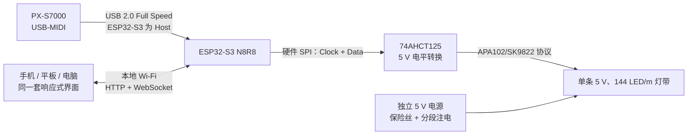
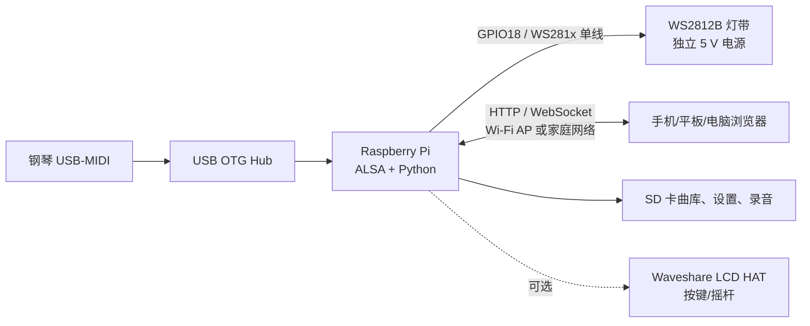
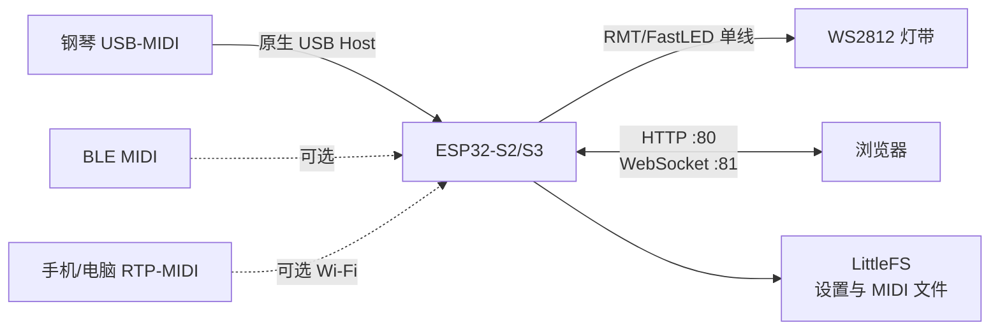
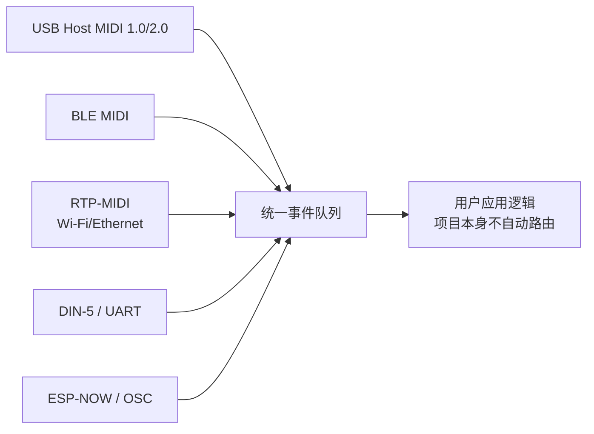
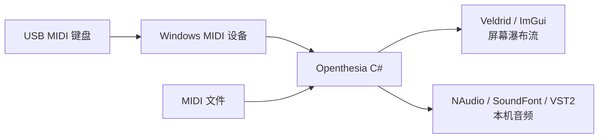

# 钢琴灯光与 MIDI 可视化开源项目技术调研

> 调研快照：2026-08-05
> 适用项目：NoteFall 88 / Casio PX-S7000 单排实体灯带辅助系统
> 目的：确认哪些成熟设计值得吸收、哪些技术债不应继承，并据此固定本项目的硬件和软件边界。

## 1. 结论先行

没有一个现有项目能原样满足本项目，但四个项目分别解决了不同问题：

| 最值得参考的部分 | 对应项目 | 原因 |
|---|---|---|
| 最接近的硬件拓扑 | [PianoLux ESP32](https://github.com/serifpersia/pianolux-esp32) | 已验证 ESP32-S2/S3 可同时承担 USB MIDI Host、Wi-Fi 网页和单排灯带控制 |
| 最完整的实体灯带产品流程 | [Piano-LED-Visualizer](https://github.com/onlaj/Piano-LED-Visualizer) | 曲库、练习、录制、校准、配置、网页控制和独立运行最完整 |
| 最可靠的 ESP32 MIDI 输入参考 | [ESP32_Host_MIDI](https://github.com/sauloverissimo/ESP32_Host_MIDI) | USB 枚举、端点解析、断线恢复、事件队列和测试覆盖最有价值 |
| 最好的瀑布流与桌面练习交互参考 | [Openthesia](https://github.com/ImAxel0/Openthesia) | 播放时钟、等待练习、左右手配色、速度控制和录制交互成熟 |
| 浏览器 MIDI 文件解析 | [Tonejs/Midi](https://github.com/Tonejs/Midi) | 能正确处理 tempo map，避免重复编写容易出错的 SMF 时间换算 |

因此 NoteFall 88 不会复制其中某一个项目，而采用组合后的架构：



关键区别是：**实时按键数据走钢琴到 ESP32 的 USB 直连，Wi-Fi 只负责界面、乐曲和设置。** 因此 Wi-Fi 抖动不会进入“按键亮灯”关键路径。灯带采用带时钟线的 APA102/SK9822，而不是四个参考项目中常见的 WS2812；这让刷新时序更可控，也更适合 ESP32-S3 同时处理 USB 和网络任务。

## 2. 调研方法与代码规模

本报告不是只阅读项目首页。调研时固定到以下源码快照，检查了入口、依赖、硬件说明、MIDI 输入、灯带驱动、网络服务、状态存储和许可证：

| 项目 | 调研提交 | 许可证 | 近似非空源码行数¹ |
|---|---|---:|---:|
| Piano-LED-Visualizer | [`b567fd1`](https://github.com/onlaj/Piano-LED-Visualizer/tree/b567fd1237fa) | MIT | 约 32,000 |
| PianoLux ESP32 | [`2a9d10c`](https://github.com/serifpersia/pianolux-esp32/tree/2a9d10c3c744) | MIT | 约 5,700 |
| ESP32_Host_MIDI | [`dea1578`](https://github.com/sauloverissimo/ESP32_Host_MIDI/tree/dea1578d596a)（v7.2.0） | MIT | 核心约 5,100；含示例/测试约 12,700 |
| Openthesia | [`04d6e37`](https://github.com/ImAxel0/Openthesia/tree/04d6e378f178) | GPL-3.0 | 约 7,600 |
| NoteFall 88 当前工程基线 | 本仓库 | MIT | 约 1,800 + 125 项自动测试 |

¹ 这是用相同规则排除依赖目录、构建产物和压缩文件后的物理非空行近似值。翻译表、生成代码、示例和测试都会显著改变数字，所以代码行数只能说明项目体量，不能代表功能质量。NoteFall 88 当前行数较少，是因为仓库仍处在可运行工程基线阶段，不代表最终只做简陋功能。

## 3. 总体对比

### 3.1 硬件与通信拓扑

| 项目 | 主控/运行设备 | 钢琴如何接入 | 灯带如何接入 | 界面如何通信 | 是否依赖云端 |
|---|---|---|---|---|---|
| Piano-LED-Visualizer | Raspberry Pi Zero / Zero 2 W | USB-MIDI，经 Linux ALSA、mido、python-rtmidi | GPIO18 驱动 WS281x，灯带独立 5 V 供电 | Flask/Waitress HTTP + WebSocket；Wi-Fi 热点或家庭网络 | 否 |
| PianoLux ESP32 | ESP32-S2/S3 | 原生 USB Host；也提供 BLE MIDI、RTP-MIDI 等替代入口 | GPIO + RMT/FastLED 驱动 WS2812 | ESPAsyncWebServer HTTP + WebSocket；AP/STA/mDNS | 否 |
| ESP32_Host_MIDI | ESP32-S2/S3/P4 等 | USB Host、BLE、RTP-MIDI、DIN UART、ESP-NOW 等可选 | 不包含灯带 | 只提供 MIDI 传输 API，不包含成品界面 | 否 |
| Openthesia | Windows 电脑 | 操作系统 MIDI 设备接口 | 不包含实体灯带 | 本机桌面 UI；无 ESP32 网络协议 | 否 |
| **NoteFall 88** | **ESP32-S3 N8R8 + 手机/平板/电脑浏览器** | **PX-S7000 USB-MIDI 直连原生 USB Host** | **硬件 SPI + 74AHCT125 驱动 APA102/SK9822** | **本地 HTTP + WebSocket；AP/STA** | **否** |

### 3.2 功能矩阵

符号含义：● 已有；◐ 部分支持或需组合使用；— 不属于该项目。

| 功能 | Piano-LED-Visualizer | PianoLux | ESP32_Host_MIDI | Openthesia | NoteFall 88 目标 |
|---|:---:|:---:|:---:|:---:|:---:|
| 按下琴键即时亮灯 | ● | ● | 仅输出 MIDI 事件 | ◐ 屏幕显示 | ● |
| MIDI 文件预提示 | ● | ● | — | ● | ● |
| 等待用户弹对再继续 | ● | ◐ | — | ● | ● |
| 屏幕瀑布流 | ◐ | ◐ | — | ● | ● |
| 单排 88 键实体灯带 | ● | ● | — | — | ● |
| 用户校准灯位/方向 | ● | ● | — | — | ●，且使用真实键位中心模型 |
| 曲库与上传管理 | ● | ● | — | ● | ● |
| 循环、速度、左右手 | ● | ◐ | — | ● | ● |
| 录制与回放 | ● | — | 提供事件能力 | ● | ● |
| OTA 固件升级 | — | ● | — | — | ● |
| 手机/平板友好界面 | ◐ | ◐ | — | — | ● |
| USB 断线自动恢复 | ◐ | ◐ | ● | 由操作系统处理 | ● |
| 自动化测试 | 较少 | 较少 | ● | ◐ | ● |

## 4. Piano-LED-Visualizer

### 4.1 它是什么

这是四个项目中最接近“可长期放在钢琴上使用的完整设备”的方案。它把 Raspberry Pi 变成一台独立灯光主机，既能监听钢琴实时 MIDI，也能从本机曲库播放 MIDI 并执行等待练习。



### 4.2 实现功能

- 实时 MIDI 灯光、力度与延迟熄灭效果、背景光和多种颜色模式。
- MIDI 文件上传、重命名、删除、播放、录制和下载。
- 等待练习、左右手/音轨选择、速度控制、灯光预提示。
- 灯带方向、起始音、偏移、反转、像素密度等校准。
- 浏览器管理界面、WebSocket 实时状态、LED 模拟器。
- 可选 LCD HAT，使设备在不打开手机的情况下运行。
- 可与 Synthesia 等外部软件通过 Linux MIDI 端口配合。

### 4.3 优点

1. **产品闭环最完整。** 它证明用户真正需要的不只是“一个音符对应一个灯”，还包括曲库、持久配置、恢复播放、练习状态、录音和诊断。
2. **硬件资料丰富。** 电源、GPIO、灯带密度、可选铝槽/扩散件、保护壳和热点配置都有现成经验。
3. **独立运行能力强。** 断开互联网后仍能工作，符合乐器附件的预期。
4. **MIT 许可证宽松。** 可在保留版权与许可证的前提下研究或复用局部思想。

### 4.4 缺点

1. **Raspberry Pi 对本项目偏重。** Linux、SD 卡、系统服务、Python 依赖和 USB Hub 增加了成本、启动时间、维护面和故障点。
2. **实时链路更长。** 数据要经过 USB、Linux ALSA、Python 事件循环再到 WS281x 驱动。它可以达到可用体验，但比 ESP32 裸机路径更难做到完全确定的时序。
3. **WS281x 是无时钟单线协议。** 刷新期间对时序要求严格；本项目还要并发 USB Host 与 Wi-Fi，因此选择带独立时钟的 APA102/SK9822 更稳妥。
4. **工程形态较“树莓派应用”。** root/systemd、系统镜像、SD 卡写入和多进程端口不适合我们想要的插电即用小控制盒。
5. **键位映射仍以偏移和比例校准为主。** 它没有成为 PX-S7000 真实白键/黑键中心的参数化几何模型。

### 4.5 我们具体学习什么

- 曲库的“上传—检查—播放—练习—录制—导出”完整生命周期。
- 设备配置持久化、配置档案、恢复默认值和状态诊断页面。
- 等待练习状态机、左右手/音轨过滤、速度与循环交互。
- MIDI 端口断开重连、录音事件时间戳和浏览器 LED 模拟器。
- 首次开机热点、局域网发现和不依赖云端的产品原则。

不会照搬 Raspberry Pi/Linux 主机、WS281x 驱动、LCD HAT、root 服务和整套旧网页。

## 5. PianoLux ESP32

### 5.1 它是什么

PianoLux 是与 NoteFall 88 **硬件结构最接近**的参考：ESP32-S2/S3 直接作为 USB Host 读取数码钢琴，同时自己提供 Wi-Fi 网页并驱动最多约 176 个 WS2812 像素。



### 5.2 实现功能

- ESP32-S2/S3 原生 USB MIDI Host。
- 备选 BLE MIDI 客户端和 AppleMIDI/RTP-MIDI 网络输入。
- AP 配网、家庭 Wi-Fi、mDNS、本地网页与 WebSocket 实时控制。
- 颜色、亮度、力度、淡出、背景光、分区和动画效果。
- 灯带反转、键盘尺寸、偏移和 1:1/1:2 像素映射。
- LittleFS 文件存储、MIDI 文件播放、OTA 和 WebSerial 诊断。

### 5.3 优点

1. **证明了核心组合可行。** ESP32-S3 可以同时做 USB Host、Wi-Fi 服务和灯带控制，不需要再加 MAX3421E USB Host 芯片。
2. **成本低、启动快、设备简单。** 没有 Linux、SD 卡和后台服务。
3. **网络接入方式适合乐器附件。** AP/STA、mDNS、WebSocket 和 OTA 都能迁移为我们的设备管理能力。
4. **实现体量可控。** 相比树莓派方案，更容易做成真正的嵌入式产品。

### 5.4 缺点

1. **主固件和网页都较集中。** 大型 `.ino` 与单个约 2,200 行的网页脚本会逐渐难以测试和维护。
2. **兼容分支较多。** USB、BLE、RTP-MIDI、多种芯片和多种启动模式混在同一产品中，会扩大故障面。
3. **仍使用 WS2812。** RMT 能改善驱动，但灯带刷新仍是严格时序的单线操作；本项目用硬件 SPI 更容易隔离实时任务。
4. **键位映射以线性索引、整体偏移和修正值为主。** 这在“看起来大致对齐”时够用，但不能保证每个白键/黑键实际中心的误差最小。
5. **工程发布流程偏开发者。** Arduino IDE、板型条件编译和部分手工配置不够适合普通用户的一键升级。

### 5.5 我们具体学习什么

- ESP32-S3 原生 USB Host 与 Wi-Fi 同机并发的任务划分。
- AP 首次配网、STA 正常使用、mDNS 发现和 WebSocket 状态同步。
- OTA、LittleFS 曲目上传和网页端设备诊断。
- 把 ESP32 作为唯一硬件主控，而不是再加入树莓派。

不会照搬 WS2812/RMT、巨型单文件结构、所有备用 MIDI 传输方式以及线性键位映射。

## 6. ESP32_Host_MIDI

### 6.1 它是什么

它不是完整钢琴灯光产品，而是一套 ESP32 MIDI **传输与事件库**。它最有价值的部分是把多种物理传输统一成 MIDI 事件，并处理 USB 设备枚举、断线、队列和 MIDI 1.0/2.0 数据格式。



### 6.2 实现功能

- ESP32-S2/S3/P4 的 USB Host MIDI 1.0 与 MIDI 2.0 UMP。
- BLE MIDI、AppleMIDI/RTP-MIDI、ESP-NOW、OSC、UART/DIN-5 和可选以太网。
- 线程安全事件队列、活动音符跟踪、和弦聚合、力度过滤、SysEx 和历史记录。
- 设备连接/断开处理、示例工程和针对解析/队列行为的测试。

### 6.3 优点

1. **最难的底层问题覆盖最好。** USB 描述符、接口/端点识别、传输回调、异常包和设备移除都比普通示例完整。
2. **事件模型值得采用。** 上层灯光和练习逻辑不应直接依赖 USB 原始包，而应消费统一的 Note On/Off 等事件。
3. **测试价值高。** 和弦、队列、MIDI 2.0、过滤器和边界数据都有可复用的测试思路。
4. **MIT 许可证。** 可以在履行许可证要求后采用经过裁剪的实现思想。

### 6.4 缺点与一个需要纠正的上游说法

1. **功能范围远超本项目。** 把 BLE、ESP-NOW、OSC、RTP-MIDI、以太网和 MIDI 2.0 全部编入首版，只会增加 Flash/RAM、依赖和回归测试成本。
2. **它不包含灯光、网页、曲库或练习逻辑。** 不能把这个库误认为完整方案。
3. **文档中关于“USB Host 与 Wi-Fi/BLE 不能同时运行”的表述不准确。** ESP32-S3 的共享关系是内部 USB PHY 在 **USB-OTG 与 USB-Serial/JTAG** 之间共享，不是与 Wi-Fi/BLE 射频共享。Espressif 的[官方 USB Host 文档](https://docs.espressif.com/projects/esp-idf/en/stable/esp32s3/api-reference/peripherals/usb_host.html)和[ESP32-S3 数据手册](https://documentation.espressif.com/esp32-s3_datasheet_en.pdf)都把 Wi-Fi/BLE 与 USB OTG 列为独立外设。PianoLux 的实际架构也旁证了 USB Host 与 Wi-Fi 可以并发。

这意味着本项目可以让 ESP32-S3 同时连接 PX-S7000 和手机 Wi-Fi；需要避开的只是让同一个内部 USB PHY 同时承担 OTG Host 与 USB-Serial/JTAG。开发日志/刷机使用开发板独立的 UART 桥接口即可。

### 6.5 我们具体学习什么

- USB MIDI 1.0 枚举、端点筛选、输入包解析和断线重连。
- USB 回调只负责入队，灯光、练习和网络任务消费规范化事件。
- 活动音符集合、队列溢出计数、异常包诊断和可重复单元测试。
- 为未来 MIDI 2.0 留事件字段，但首版不启用不必要的传输后端。

当前策略不是把整个库直接塞进固件，而是保留一个项目专用、可测试的 `UsbMidiHost` 子集；这样既吸收成熟边界处理，又避免把未使用功能变成维护负担。

## 7. Openthesia

### 7.1 它是什么

Openthesia 是 Windows 桌面端的开源 Synthesia 类软件。它从操作系统 MIDI 设备读取键盘事件，在 GPU 界面中显示瀑布流，并可用 SoundFont/VST 发声。它没有 ESP32，也不控制实体灯带。



### 7.2 实现功能

- MIDI 文件瀑布流、实时演奏显示和播放控制。
- 等待弹对再继续、速度调整、方向切换和左右手颜色。
- MIDI 录制/导出、SoundFont、VST2、视频录制和主题设置。
- 针对桌面 GPU 的高帧率渲染和音频播放。

### 7.3 优点

1. **练习交互成熟。** 播放时钟、等待状态、音符命中、左右手和速度变化是很好的行为参考。
2. **屏幕渲染职责清楚。** MIDI 时间线、输入状态、音频和画面是不同子系统。
3. **适合作为功能上限参考。** 它说明“代码少”不应等于“只做几个按钮”；我们的手机/平板界面也应达到完整练习软件的体验。

### 7.4 缺点

1. **平台和本项目不同。** Windows、GPU、VST、音频插件都不适合直接塞进 ESP32 或手机网页。
2. **没有实体灯带时序和校准问题。** 屏幕像素连续可绘制，而 144 LED/m 灯带只能选择离散物理像素。
3. **许可证是 GPL-3.0。** NoteFall 88 当前采用 MIT；如果直接复制并发布其 GPL 代码，会引入相应的许可证义务。因此只研究公开行为和交互，独立实现，不复制源码。

### 7.5 我们具体学习什么

- 以统一 MIDI 时间线驱动屏幕瀑布流、灯带预提示和等待练习。
- 循环片段、变速、左右手分色、命中判定和录制时间线。
- 屏幕渲染器与硬件灯带渲染器分开：前者追求连续动画，后者只发送当前需要的离散灯位。

不会复制 GPL 源码，也不会引入 VST、Windows API 或电脑端音频合成管线。PX-S7000 自己负责发声，本项目只负责提示和练习状态。

## 8. 两个辅助参考

### 8.1 Tonejs/Midi

[`@tonejs/midi`](https://github.com/Tonejs/Midi) 是 MIT 许可的浏览器/Node MIDI 文件解析库，不是钢琴硬件项目。它的价值是正确解析 SMF 的音轨、tempo map、拍号和音符时值，再转成统一秒时间线。NoteFall 网页端保留这一依赖，但不会使用 Web Audio 合成钢琴声。

它不能替代：

- 实时 USB MIDI Host；
- MusicXML/五线谱排版；
- 练习判定状态机；
- ESP32 灯位调度。

### 8.2 Piano Trainer Studio

[Piano Trainer Studio](https://pianotrainerstudio.com/) 是产品体验参考，不是本报告可审计的开源依赖。可研究它公开展示的谱面、等待练习、LED 校准和移动端布局，但不能假设其内部硬件拓扑，更不会复制未明确授权的网页代码。

## 9. 映射算法：为什么不能简单“第 N 个键 = 第 N 个灯”

很多开源灯带项目采用如下简化：

```text
led = midi_note - first_note + global_offset
```

或者再加一个整体比例和左右修正。这种方法实现很快，但 88 键钢琴与 144 LED/m 灯带的节距并不相同：

- 灯带像素中心间距约为 `1000 / 144 = 6.944 mm`；
- 白键中心间距约为 23.5 mm；
- 黑键不是等距排列，而且它们的视觉中心与白键序列不同；
- 一枚琴键可能对应相邻 3～4 个像素中的某一个，而不是连续的第 N 个像素。

NoteFall 88 因此采用两层映射：

1. 用参数化键盘几何生成 88 个实际键位中心；
2. 用安装后测得的灯带原点、方向和有效长度，把每个键位中心量化到最近像素，并检查重复、越界和误差。

校准界面只调整少数可理解参数，不让用户手工填写 88 个数字。这样既能适配 PX-S7000 实物误差，也能在换灯带或反向安装后重新生成映射。

## 10. NoteFall 88 固定下来的工程决策

| 决策 | 采用方案 | 从参考项目得到的证据 |
|---|---|---|
| 主控制器 | ESP32-S3 N8R8，不使用 Raspberry Pi | PianoLux 证明单 MCU 拓扑成立；Pi 方案的系统维护成本无必要 |
| 钢琴通信 | PX-S7000 USB-MIDI 直连 ESP32-S3 原生 USB Host | ESP32_Host_MIDI 提供成熟的枚举与队列参考 |
| 手机/平板通信 | 本地 Wi-Fi HTTP + WebSocket | 两个实体灯带项目都证明浏览器管理适合无云设备 |
| 实时边界 | USB MIDI 直接驱动灯光；Wi-Fi 不在按键关键路径 | 避免网络抖动影响即时反馈 |
| 灯带 | 一条完整的 5 V、144 LED/m APA102C 或 SK9822 | 比 WS2812 多时钟线，但刷新更确定，两个型号协议兼容 |
| 电气接口 | 3.3 V SPI 经 74AHCT125 转 5 V；灯带独立供电、共地 | 防止 ESP32 直接驱动 5 V 逻辑造成边缘不可靠 |
| 机械安装 | 灯带竖直面向演奏者/琴键方向；不采用全长 3D 打印盒或导轨 | 保留光线直接照到键面的效果，减少高度和遮光 |
| 键位映射 | 参数化真实键位中心 + 少量现场校准 | 改进现有项目常见的线性偏移模型 |
| 软件形态 | 响应式 Web/PWA 为同一核心；需要商店安装时再用 Capacitor 封装 | 一份代码覆盖手机、平板和电脑，避免同时维护网页与原生 App |
| 练习引擎 | 统一时间线，屏幕瀑布流和实体灯带使用不同渲染器 | 学习 Openthesia 的时钟/状态模型，不复制 GPL 代码 |
| 首版传输范围 | 只启用 USB MIDI；BLE/RTP/OSC 等留作未来插件 | ESP32_Host_MIDI 的广度有参考价值，但不是首版需求 |

## 11. 由调研转化出的实现清单

### P0：硬件可靠性与基本闭环

- USB MIDI 枚举、Note On/Off、延音踏板和断线恢复实机测试。
- APA102/SK9822 SPI 驱动、全黑安全启动、总亮度和电流限制。
- 88 键参数化映射、方向/原点校准和映射诊断图。
- ESP32 AP/STA、WebSocket 状态、设置持久化和故障日志。
- 浏览器选择 MIDI 文件，向设备下发带时间戳的预提示事件。

### P1：完整练习产品

- 曲库、最近使用、上传/删除/重命名和元数据。
- 等待弹对、左右手、循环、变速、提前量和倒计时。
- 屏幕瀑布流、虚拟键盘、实体灯带状态预览和命中反馈。
- 演奏录制、回放、错误统计和可导出 MIDI。
- 手机/平板横竖屏布局、PWA 安装和离线缓存。

### P2：产品化能力

- OTA 固件与网页资源升级、版本回滚和兼容性检查。
- 首次安装向导、电源/灯带方向自检、USB 状态诊断。
- 设备配置备份、多个用户档案、多个键盘/灯带校准档案。
- 如真实需求成立，再评估 Capacitor 原生壳、BLE 或 RTP-MIDI；不提前增加无用分支。

## 12. 最终判断

正确路线不是“找到代码最多的项目然后照抄”，也不是只写一个能点灯的 2,000 行演示：

- 用 **PianoLux** 证明 ESP32-S3 单主控硬件路线；
- 用 **ESP32_Host_MIDI** 提高 USB 底层可靠性；
- 用 **Piano-LED-Visualizer** 补齐长期使用所需的曲库、校准、录制和诊断；
- 用 **Openthesia** 定义瀑布流、时间线和练习体验的功能上限；
- 结合 PX-S7000、APA102/SK9822 和真实琴键几何，重新实现一个更小、更确定、移动端优先的系统。

这套取舍保留了成熟项目最难验证的经验，同时避免继承 Linux 主机、WS2812 时序、线性灯位、GPL 代码和无关 MIDI 传输造成的复杂度。

## 13. 主要资料

- [Piano-LED-Visualizer 源码与安装说明](https://github.com/onlaj/Piano-LED-Visualizer)
- [PianoLux ESP32 源码与接线说明](https://github.com/serifpersia/pianolux-esp32)
- [ESP32_Host_MIDI v7.2.0 源码与示例](https://github.com/sauloverissimo/ESP32_Host_MIDI/tree/dea1578d596a)
- [Openthesia 源码](https://github.com/ImAxel0/Openthesia)
- [Tonejs/Midi 源码](https://github.com/Tonejs/Midi)
- [Espressif ESP32-S3 USB Host 官方文档](https://docs.espressif.com/projects/esp-idf/en/stable/esp32s3/api-reference/peripherals/usb_host.html)
- [Espressif ESP32-S3 数据手册](https://documentation.espressif.com/esp32-s3_datasheet_en.pdf)
