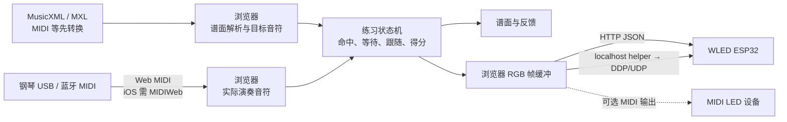
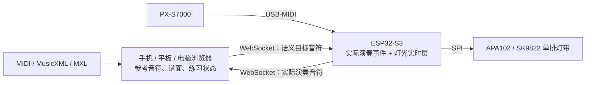

# Piano Trainer Studio 采用决策

> 状态：已接受  
> 日期：2026-08-05  
> 适用范围：NoteFall 88 网页、固件通信协议、乐谱与练习引擎  
> 审计对象：Piano Trainer Studio [`9b21d7e`](https://github.com/ztbishop/piano-trainer-studio/tree/9b21d7e7277aa1da8d82b3d67fe036bfccd11e81)（v1.2.4，AGPL-3.0）

## 决策

Piano Trainer Studio（PTS）提升为 NoteFall 88 的**第一软件/产品参考**，但本仓库不 fork、不复制 PTS 的源码或网页资源。NoteFall 88 继续采用 MIT，按公开功能和可观察行为独立实现；第三方库单独评估并保留各自许可证。

如果未来决定直接修改 PTS，修改版将进入独立的 AGPL 仓库/发行物，不与当前 MIT 核心混为一个仅标 MIT 的产品。此处是工程许可证边界记录，不替代正式法律意见。

## 为什么必须先做这个决策

PTS 与目标功能高度重合：MusicXML/MXL 谱面、Realtime、Wait for Me、Follow Me、左右手、循环、变速、移调、得分、IndexedDB 曲库/备份和逐键 LED 校准都已经存在。忽略它会重复探索产品行为；直接搬用它又会改变许可证、运行位置和硬件链路。因此在继续曲库、MusicXML 和 Follow Me 之前，必须明确哪些是产品需求，哪些是可复用依赖，哪些不能复制。

## 已审计的 PTS 架构

PTS 的核心计算在浏览器，不在 WLED：

必须区分两路数据：

1. **参考/目标音符**来自浏览器加载的 MusicXML/MXL，或由 MIDI、MuseScore、Guitar Pro 转换后的 MusicXML。
2. **实际演奏音符**来自钢琴 MIDI 输入。

浏览器比较两路数据。WLED 通常只收最终 RGB 像素帧，不解析乐谱，也不知道左右手和命中规则。PTS 的低延迟 DDP 不是浏览器直接发送 UDP，而是把完整帧 POST 给本机 Node helper，再由 helper 发到 WLED 的 UDP 4048 端口；无 helper 时回退 HTTP JSON。

## NoteFall 的目标拓扑

与 PTS 相比，NoteFall 把钢琴 MIDI Host 和灯带驱动放在同一台 ESP32-S3：

- 按下琴键后的即时亮灯不经过 Wi-Fi；
- iPhone/iPad/Android 页面不需要 Web MIDI，也不需要 MIDIWeb；
- 浏览器发送的是“哪些 MIDI 音符是目标、显示何种角色”的语义消息，而不是持续发送 176 个 RGB 像素；
- ESP32 掌握真实灯位映射、亮度/电流上限、超时熄灯和安全状态；
- 浏览器仍掌握乐谱、时间线、循环、左右手、判分和曲库。

这条边界允许界面暂时掉线时仍保留本地按键反馈，也不会让 Wi-Fi 抖动进入最短实时路径。

## 两种路线比较

| 维度 | 直接 fork PTS 网页（AGPL） | NoteFall 独立实现（MIT，已选） |
|---|---|---|
| 首批成熟功能 | MusicXML、三模式、谱面、曲库和校准可较快获得 | MIDI/MusicXML/MXL、谱面、实时/等待、循环、左右手、曲库和录制已有独立实现；Follow/移调/逐键校准待补 |
| 许可证 | 衍生前端必须遵守 AGPL；网络交互版本须显著提供相应源码 | 自写核心保持 MIT；每个第三方依赖按自己的许可证归档 |
| 与现有硬件的匹配 | 默认 Web MIDI → 浏览器 → WLED；需重写输入、灯光和连接状态 | 原生就是 PX-S7000 → ESP32 → APA102/SK9822 |
| iOS/Android | iOS MIDI 需 MIDIWeb，WLED 场景还可能需 PC/Mac helper | 移动浏览器只连 ESP WebSocket，不需要 Web MIDI/helper |
| 实时灯光 | 浏览器生成 RGB 帧并经网络发往 WLED | ESP 直接处理实际按键；目标音符才经 Wi-Fi 提前下发 |
| 部署资源 | PTS 重型资源通常运行/存储在手机、平板或电脑，不要求进入 WLED；若坚持 ESP 单机托管才受 LittleFS 限制 | Core 内置离线网页与 gzip OSMD；未来 Studio 可由预装 PWA、原生壳或桌面端承载重型资源 |
| 工程结构 | Plain JS + 多个全局模块；核心/LED 大文件，适配会是侵入式改造 | TypeScript 模块、协议版本、单元测试和固件 CI 已建立 |
| 长期维护 | 能获得上游修复，但每次合并都要处理自定义硬件分叉 | 需要自己实现功能，但边界更小、设备行为更确定 |
| 最终用户步骤 | 可能需要浏览器 MIDI 权限、MIDIWeb 或 helper | 预期只需钢琴接 ESP、手机连设备 Wi-Fi 并打开页面 |

结论不是“AGPL 不好”，也不是“PTS 太大所以不能用”，而是 PTS 的许可证和默认拓扑都对应另一种产品。即使接受 AGPL，仍需大规模改写 MIDI 输入、WLED 帧输出、设备诊断和移动端路径；fork 并不能直接变成 NoteFall 成品。若未来的功能差距证明独立实现成本失控，可把 PTS 改造版作为单独 AGPL Studio 重新评估，而不推翻已经稳定的 ESP Core。

## 资源容量与运行位置

PTS 原本就不是把网页、OSMD、webmscore、曲库和练习引擎放进 WLED ESP32；这些资源运行在浏览器，WLED 主要接收灯光帧。以下数据只回答“哪些资源能随 NoteFall Core 一起烧进 N8R8”，不能单独决定是否采用 PTS 前端。

当前 ESP32-S3 N8R8 分区为双 OTA 应用各 `0x280000`，LittleFS 为 `0x2E0000`（2.875 MiB）：

| 资源 | 审计大小 | NoteFall 处理 |
|---|---:|---|
| OSMD 压缩脚本 | 1,206,484 bytes | 已独立集成 1.9.9；生产 gzip 为约 306 kB，buildfs 与 390 px 手机渲染已通过 |
| Tone.js | 349,169 bytes | 不需要；PX-S7000 自己发声 |
| webmscore 目录 | 24,173,611 bytes | 不嵌入固件；后续可做可选电脑端转换包 |
| PTS 自写 JS/CSS/HTML/helper | 约 15,720 非空行 | 只研究功能与边界，不复制 |

因此当前 Core 采用“MusicXML/XML/MXL 原生导入 + MIDI 原生导入”。MuseScore/Guitar Pro 用户可先导出 MusicXML。若增加重型转换器，它应进入预安装的 Studio 层并离线缓存，不必进入 ESP；同时必须实测 iOS/Android 对本地私网和明文 WebSocket 的策略，必要时使用原生壳。

## 分功能采用计划

| PTS 已验证的能力 | NoteFall 做法 | 采用边界 |
|---|---|---|
| MusicXML/MXL + 谱面 | 已独立集成 OSMD（BSD-3-Clause）与自己的安全解压/时间线/谱面适配层 | 不复制 PTS 的 OSMD 包装和 trainer-core |
| MIDI/MuseScore/Guitar Pro 转换 | MIDI 保留 `@tonejs/midi`；重型格式转换后置到可选桌面包 | 不把 24 MB webmscore 塞入 ESP |
| Realtime / Wait / Follow | 在现有 TypeScript 练习引擎上补 Follow Me 和踏板语义 | 用测试定义行为，不复制状态机代码 |
| 左右手/循环/变速/移调/得分 | 延续统一时间线和声部过滤；加入版本化练习配置 | 目标灯与判分消费同一过滤结果 |
| IndexedDB 曲库/备份 | 已独立实现版本化 schema、文件夹、最近使用、内容去重和 SHA-256 可校验备份 | 借鉴产品需求，不复制对象结构或 UI 代码 |
| LED 逐键校准 | 先用真实琴键几何 + 原点/方向/全局偏移；实测不足时再加逐键微调 | 灯位真相在 ESP；浏览器只操作语义参数 |
| WLED HTTP/DDP | 不作为主链路 | ESP 直接 SPI 驱动 APA102/SK9822，无 helper |
| Web MIDI/MIDIWeb | 不作为 PX-S7000 主链路；未来可作为无硬件演示输入 | 手机只消费 ESP 标准化事件 |

## 独立实现的可审计规则

- 本仓库不导入 PTS 文件、代码片段、CSS、图片、曲库或构建产物。
- 新功能先写 NoteFall 行为规格与测试，再在现有 TypeScript/C++ 模块中实现。
- 可复用第三方依赖从其官方发行渠道单独引入，固定版本，保存许可证和 NOTICE，而不是从 PTS 的 vendored 副本复制。
- 提交说明标明“受哪项公开产品行为启发”与“实际独立实现文件”，便于后续审计。
- 若需要制作 PTS 兼容桥或直接给 PTS 增加 NoteFall 输出端，单独建 AGPL 项目并保留显著源码入口。

因为当前工程人员已经阅读过 PTS 源码，本方案不宣称是由隔离团队执行的 formal clean-room 工程；准确说法是“源码可审计后的独立实现，并禁止复制”。

## 进度与继续开发顺序

1. **已完成**：延音踏板（CC64）、All Notes Off、通道化演奏录制和 MIDI 导出。
2. **已完成**：IndexedDB 曲库、文件夹、内容去重、版本化校验备份与失败预验证。
3. **已完成数字验收**：OSMD、MusicXML/MXL 安全解压、统一时间线、gzip 固件资源，以及桌面/390 px 手机浏览器渲染。
4. **下一阶段**：用多来源真实钢琴曲建立兼容性语料；实现反复/跳转顺序后再把这些曲目纳入正式判分。
5. **下一阶段**：补 Follow Me、移调和逐键微调，并决定伴奏输出走 PX-S7000 USB MIDI OUT 还是可选浏览器合成器。
6. **后续独立决策**：对比 Studio/PWA/原生壳与独立 AGPL PTS Studio；webmscore 不能成为钢琴前日常练习的必需联网步骤。

## 参考资料

- [Piano Trainer Studio 官方仓库](https://github.com/ztbishop/piano-trainer-studio)
- [Piano Trainer Studio 官方使用说明](https://pianotrainerstudio.com/README.html)
- [PTS 固定审计提交](https://github.com/ztbishop/piano-trainer-studio/tree/9b21d7e7277aa1da8d82b3d67fe036bfccd11e81)
- [GNU AGPL-3.0 正文](https://www.gnu.org/licenses/agpl-3.0.en.html)
- [GNU GPL FAQ：AGPL 网络交互](https://www.gnu.org/licenses/gpl-faq.en.html#AGPLv3InteractingRemotely)
- [OpenSheetMusicDisplay 官方仓库（BSD-3-Clause）](https://github.com/opensheetmusicdisplay/opensheetmusicdisplay)
